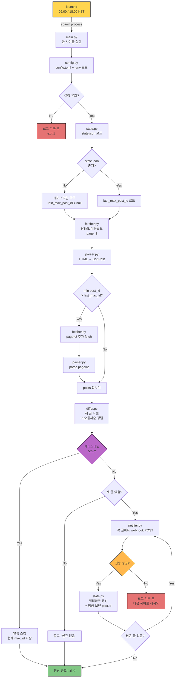
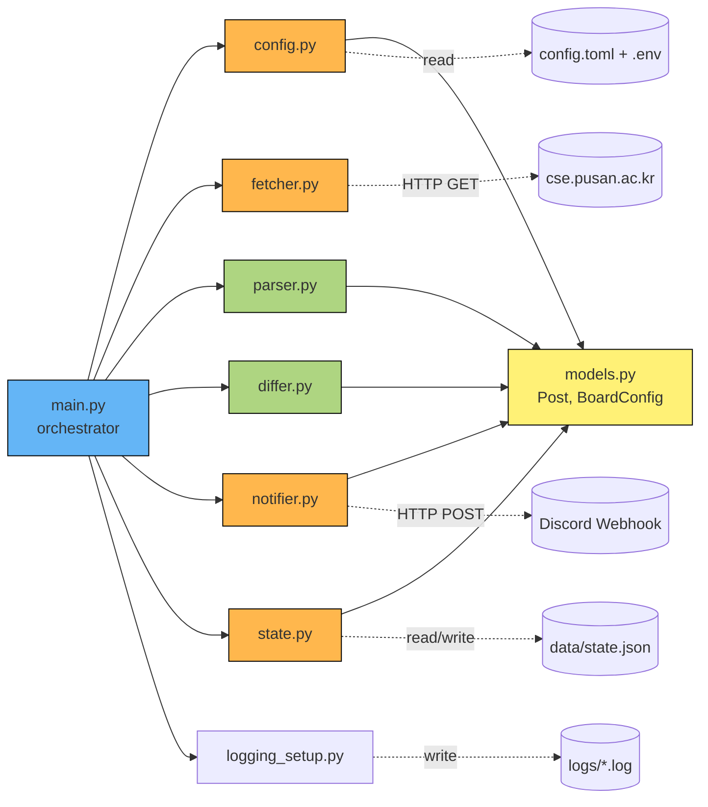
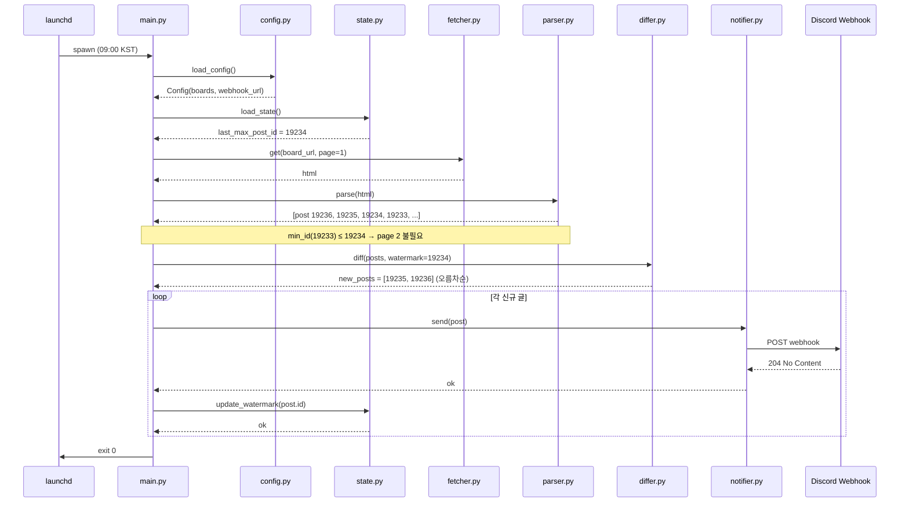
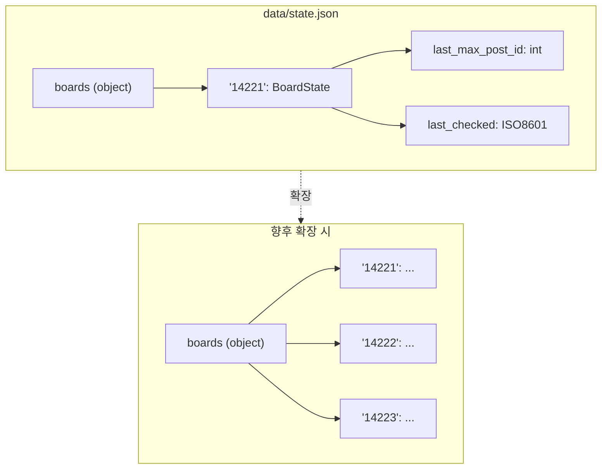
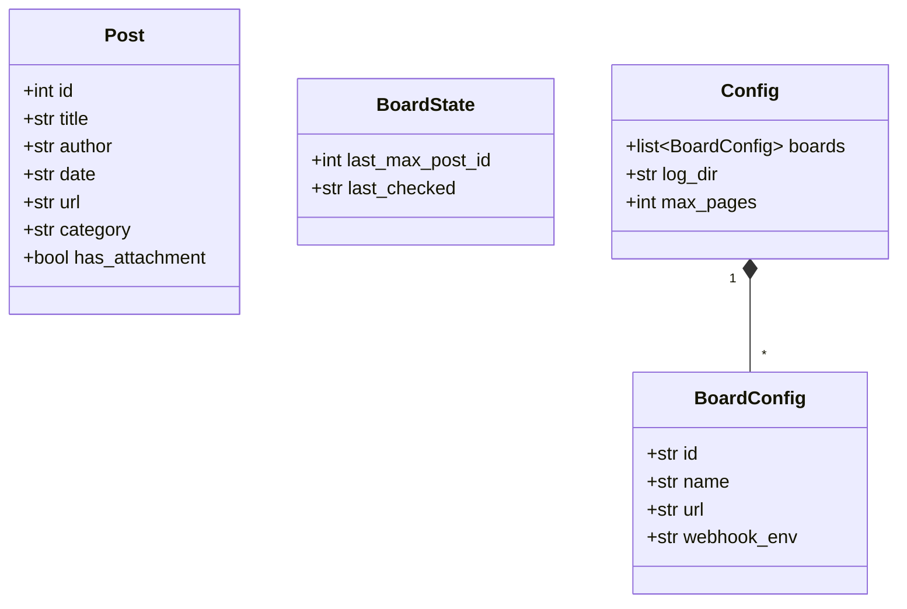

# PNU CSE Discord Bot — Data Flow

본 문서는 한 실행 사이클 동안의 데이터 흐름과 모듈 간 상호작용을 시각화합니다.

## 1. 전체 실행 흐름 (End-to-End Pipeline)



## 2. 컴포넌트 의존 관계 (Module Dependencies)



**범례:**
- 🟢 초록: **순수 함수** (I/O 없음, 결정론적, 테스트 쉬움)
- 🟠 주황: **I/O 모듈** (네트워크, 파일 시스템 접근)
- 🔵 파랑: **오케스트레이터**
- 🟡 노랑: **데이터 모델**

## 3. 시퀀스 다이어그램 (정상 케이스, 신규 글 2개)



## 4. 상태 저장 구조 (State Schema)



```json
// 현재 (단일 게시판)
{
  "boards": {
    "14221": {
      "last_max_post_id": 19234,
      "last_checked": "2026-04-30T18:00:00+09:00"
    }
  }
}

// 미래 (다중 게시판)
{
  "boards": {
    "14221": { "last_max_post_id": 19234, "last_checked": "..." },
    "14222": { "last_max_post_id":  8721, "last_checked": "..." }
  }
}
```

## 5. 핵심 데이터 모델



## 6. 설계 불변식 (Invariants)

다이어그램으로는 표현 어렵지만 코드/테스트가 보장해야 할 규칙:

1. **워터마크 단조 증가** — `state.last_max_post_id`는 절대 감소하지 않는다.
2. **알림 → 갱신 순서** — webhook POST 성공 응답을 받은 *뒤에만* 워터마크를 갱신한다.
3. **오름차순 전송** — 신규 글은 항상 post_id 오름차순으로 전송한다 (오래된 글부터).
4. **베이스라인 무알림** — 첫 실행 시 알림 0건, 워터마크만 저장한다.
5. **페이지 상한** — 한 사이클당 최대 2페이지까지만 fetch한다.
6. **부분 실패 보존** — 알림 도중 실패 시 이미 보낸 것까지는 워터마크에 반영, 실패 지점부터 다음 사이클에서 재시도한다.
